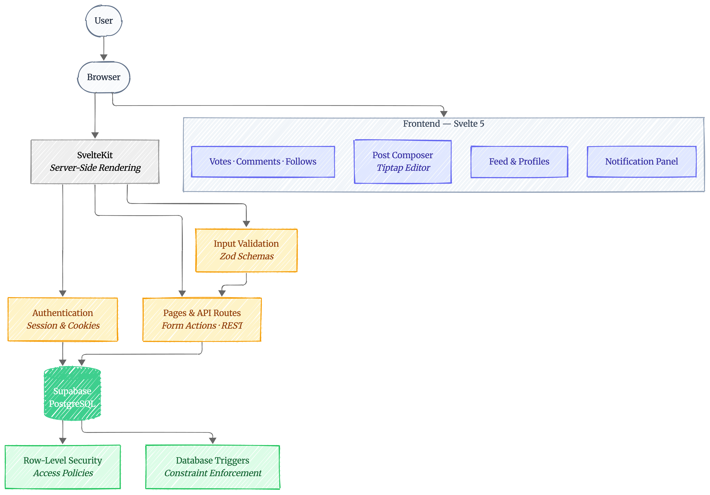

# MicroBlog

A full-stack social microblogging platform where every post is capped at **100 words** — keeping conversations concise and meaningful. Built from scratch with a modern TypeScript stack and a security-first architecture.

> **Live stack:** SvelteKit · Svelte 5 · TypeScript · Supabase (PostgreSQL) · Tailwind CSS

---

## What It Does

MicroBlog is a complete social platform with short-form writing at its core. Users can create an account, write posts with a rich text editor, follow other users, vote on content, and engage through threaded comments — all within a clean, privacy-respecting experience.

### Core Capabilities

| Feature                 | Description                                                                                                         |
| :---------------------- | :------------------------------------------------------------------------------------------------------------------ |
| **100-Word Posts**      | A strict word limit enforced on both client and server, encouraging clear and intentional writing                   |
| **Rich Text Editor**    | A full WYSIWYG composer (bold, italic, lists, code blocks, blockquotes) powered by Tiptap with live word counting   |
| **Visibility Controls** | Every post can be set to **Public**, **Followers Only**, or **Private** — enforced all the way down to the database |
| **Follow System**       | A request-based follower model with approve/reject flow, similar to private social accounts                         |
| **Voting & Comments**   | Upvote/downvote on posts with one-vote-per-user enforcement; threaded comments with one level of replies            |
| **Notifications**       | Real-time notification feed for votes, comments, replies, follow requests, and approvals                            |
| **User Profiles**       | Public profile pages at `/u/username` with post history and follow actions                                          |

---

## System Architecture



---

## Technology Stack

| Layer          | Technology                      | Purpose                                                          |
| :------------- | :------------------------------ | :--------------------------------------------------------------- |
| **Framework**  | SvelteKit + Svelte 5 (Runes)    | Full-stack rendering, routing, and server-side logic             |
| **Language**   | TypeScript                      | Type safety across the entire codebase                           |
| **Database**   | Supabase (PostgreSQL)           | Data storage with Row-Level Security policies                    |
| **Auth**       | Supabase Auth + `@supabase/ssr` | Cookie-based session management                                  |
| **Editor**     | Tiptap                          | Rich text composition with keyboard shortcuts                    |
| **Styling**    | Tailwind CSS v4                 | Utility-first styling with forms and typography plugins          |
| **Validation** | Zod                             | Runtime schema validation for all user input                     |
| **Testing**    | Vitest + Playwright             | Unit tests, browser tests, and end-to-end automation             |
| **CI/CD**      | GitHub Actions                  | Automated formatting, type checking, and test runs on every push |
| **Deployment** | Vercel                          | Serverless hosting with edge optimization                        |

---

## Database Schema


---

## Security Approach

Security is enforced at **every layer**, not just the application boundary:

- **Server-Side Validation** — All form inputs and API payloads are validated through Zod schemas before touching the database
- **Row-Level Security (RLS)** — PostgreSQL policies ensure users can only access data they are authorized to see, even if application code is bypassed
- **Database Triggers** — A PL/pgSQL trigger prevents comment nesting beyond one reply level, blocking deep spam threads at the database layer
- **Request-Scoped Auth** — Authentication state is resolved once per request and cached, preventing redundant lookups across parallel loaders

---

## Testing Strategy

The project maintains two layers of automated testing:

- **Unit & Validation Tests** — Colocated `*.spec.ts` files run via Vitest in dual environments (Node for server logic, browser for Svelte components)
- **End-to-End Tests** — Playwright automates full user journeys: registration, login, onboarding, post creation, visibility enforcement, follow workflows, and interactions

All tests run automatically in CI on every push to `master`.

---

## Getting Started

### Prerequisites

- Node.js v22+
- A Supabase project (or local Supabase CLI)

### Setup

```bash
# Clone and install
git clone <repository-url>
cd microblog
npm install

# Configure environment
cp .env.example .env
# Edit .env with your Supabase credentials

# Apply database migrations (in order)
# See supabase/migrations/ for the full list

# Start the dev server
npm run dev
```

The app will be available at [http://localhost:5173](http://localhost:5173).

### Available Commands

```bash
npm run dev            # Start development server
npm run build          # Production build
npm run check          # TypeScript type checking
npm run format:check   # Code formatting verification
npm run test           # Run all tests (unit + e2e)
```
